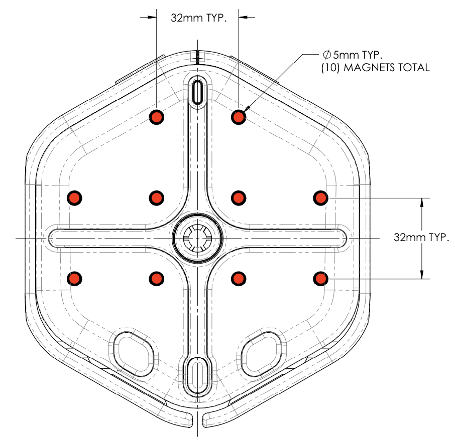

# Root Robot Accessories

[Root](https://rootrobotics.com/) is a toy robot that teaches the basics of coding to kids of all ages and skill levels. For those who want to expand Root's capabilities with accessories, we are sharing some helpful information and materials. We look forward to seeing what you create!

## Magnetic Attachment Points

Root has 10 small magnets underneath the top surface to help with attaching accessories. These are in a 32mm grid with the North pole of the magnet facing up.

## License

Root Robot Accessories are licensed under a Creative Commons Attribution 4.0 International License.

You should have received a [copy of the license](LICENSE.txt) along with this work. If not, see <http://creativecommons.org/licenses/by/4.0/>

